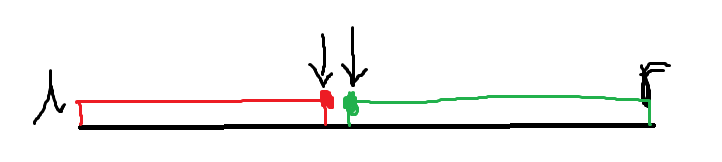

# 题目描述

给定一个按照升序排列的长度为 n 的整数数组，以及 q 个查询。

对于每个查询，返回一个元素 k 的起始位置和终止位置（位置从 00 开始计数）。

如果数组中不存在该元素，则返回 `-1 -1`。

**输入格式**

第一行包含整数 n 和 q，表示数组长度和询问个数。

第二行包含 n 个整数（均在 1∼100001∼10000 范围内），表示完整数组。

接下来 q 行，每行包含一个整数 k，表示一个询问元素。

**输出格式**

共 q 行，每行包含两个整数，表示所求元素的起始位置和终止位置。

如果数组中不存在该元素，则返回 `-1 -1`。

**数据范围**

1≤n≤100000
1≤q≤10000
1≤k≤10000

**输入样例**：

```
6 3
1 2 2 3 3 4
3
4
5
```

**输出样例**：

```
3 4
5 5
-1 -1
```

# 二分模板

二分的本质不是单调性：有单调性一定可以二分，但是二分不一定具有单调性。

二分的本质是：边界！



如图所示：红色点和绿色点分别是需要找出来的点，根据找的点不同，则可以分为两个模板（左边界和右边界）

## 二分左边界（红色点）

```C++
// 区间[l, r]被划分成[l, mid - 1]和[mid, r]时使用：
int bsearch_2(int l, int r)
{
    while (l < r)
    {
        int mid = l + r + 1 >> 1;
        if (check(mid)) l = mid;
        else r = mid - 1;
    }
    return l;
}
```

**模板解析：**

找到红色点，假定这个点为X

1. 先定义一个中间值mid
2. check一下mid是否满足"红色性质"，即mid是否在`红色区间`内。有true和false两种情况
   - 若为true，即满足红色性质，则mid在`红色区间`内，要二分出来的`红色点`X则在mid右侧。将区间更新为[mid, r], 即 l = mid
   - 若为false，即不满足中间性质，则mid不在`红色区间`内，要二分出来的`红色点`X则在mid左侧。将区间更新为[l, mid - 1]
3. 区间更新到最后，区间内只有一个值，所以return l或r都是可以的。

解释说明：这些都是建立在要找的点X在区间内部，如果不在内部则特判。所以二分是一定会有一个最终结果的。

**问题说明：**

二分左边界定义mid时为什么要将`L+R加上1`？

因为存在特殊情况，如果`L`刚好等于`R-1` 即`L=R-1`，那么如果`满足check`条件，将区间更新为`[mid, R]`时，`mid = L+R>> 1`不加1，会出现什么情况。

C++除法是下取整，`L+R>>1` = `L+L+1>>1`=`L`，区间将再次更新为[L,R]=[mid,R] = [L,R]，进入一个死循环。

## 二分右边界（绿色点）

```c++
// 区间[l, r]被划分成[l, mid]和[mid + 1, r]时使用：
int bsearch_1(int l, int r)
{
    while(l < r)
    {
        int mid = l + r >> 1;
        if (check(mid)) r = mid; // check()判断mid是否满足性质
        else l = mid + 1;
    }
    return l;
}
```

## 如何选择模板

先写check函数，看后面的更新区间：

1. 如果先更新`L`，即`l = mid`，那就是二分左边界模板。(此模板注意`+1`)
2. 如果先更新`R`，即`r = mid`，那就是二分右区间模板。

# 本题解析

## 思路

分别二分查找区间的左右端点：

1. 查找左端点，写check函数时，条件可以是`右边所有数都大于要查询的数x`
2. 查找右端点，条件可以是`左边所有数都小于要查询的数x`

查找到左右端点之后，输出下标即可。

## C++代码

```C++
#include <iostream>

using namespace std;

const int N = 100010;
int n, m;
int q[N];

int main()
{
    cin >> n >> m;
    for(int i = 0; i < n; i ++) cin >> q[i];

    while(m --)
    {
        int x;
        cin >> x;

        int l = 0, r = n - 1;
        while(l < r)
        {
            int mid = l + r >> 1;
            if(q[mid] >= x) r = mid;
            else l = mid + 1;
        }
        if(q[l] != x) cout << "-1 -1" << endl;
        else 
        {
            cout << l << ' ';

            int l = 0, r = n - 1;
            while(l < r)
            {
                int mid = l + r + 1>> 1;
                if(q[mid] <= x) l = mid;
                else r = mid - 1;
            }
            cout << l << endl;
        }
    }
    return 0;
}
```

## 代码解析

```C++
const int N = 100010; // N是题目给的范围
int n, m; // n表示输入n个数，m表示输入m个询问
int q[N]; // q[N]存的是n个数
```

```C++
int l = 0, r = n - 1; // 定义区间的左右端点
while(l < r)
{
    int mid = l + r >> 1; // 先把mid定义成l+r>>1,要不要加1看后面更新区间，决定是哪个模板
    if (q[mid] >= x) r = mid; // 如果mid对应的值大于x，要找的值一定在mid左侧，即在区间[l,mid]中。
    else l = mid + 1; 
}
```

```C++
if (q[l] != x) cout << "-1 -1" << endl; // 出了while循环之后，因为进行了一次二分，所以如果存在值x，哪个二分区间只有一个值，就是x，即区间左端点=右端点
```

```C++
else
{
    cout << l << ' ';
    
	while(l < r)
    {
        int l = 0, r = n - 1;
        int mid = l + r + 1 >> 1; 
        if(q[mid]<=x) l = mid; // 左边的数都小于x，那么x一定在区间[mid,r]中。
        else r = mid - 1; // 否则x在区间[l, mid - 1]中
    }
    cout << l << ' '; // 这里输出l或r都是可以的
}
```

